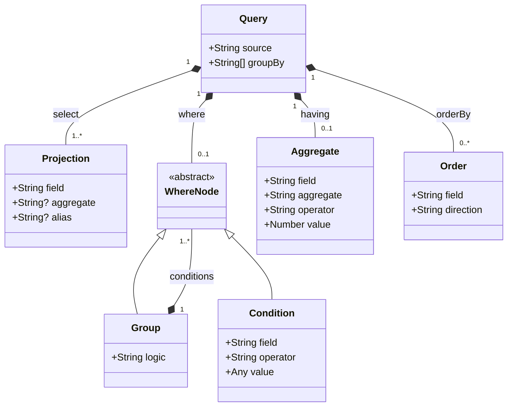

# 04 — Metamodelo del AST y Mapeo a SQL

## 1. Diagrama UML del Metamodelo

```mermaid
classDiagram
    class Query {
        +String source
        +String[] groupBy
    }
    class Projection {
        +String field
        +String? aggregate
        +String? alias
    }
    class WhereNode {
        <<abstract>>
    }
    class Group {
        +String logic
    }
    class Condition {
        +String field
        +String operator
        +Any value
    }
    class Aggregate {
        +String field
        +String aggregate
        +String operator
        +Number value
    }
    class Order {
        +String field
        +String direction
    }

    Query "1" *-- "1..*" Projection : select
    Query "1" *-- "0..1" WhereNode : where
    Query "1" *-- "0..1" Aggregate : having
    Query "1" *-- "0..*" Order : orderBy
    WhereNode <|-- Group
    WhereNode <|-- Condition
    Group "1" *-- "1..*" WhereNode : conditions
```
